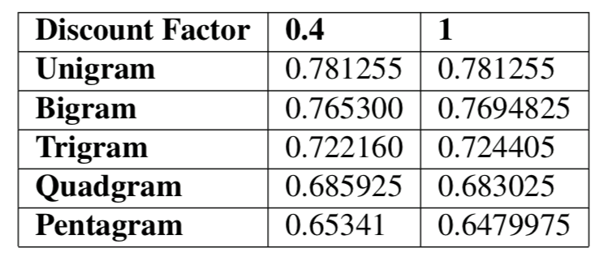
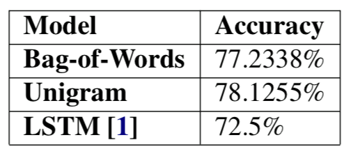

# Tweet Sentiment Analysis

KEN2570 - Natural Language Processing

### Team:
- Charlotte Dalenbrook
- Arnaud Ruymaekers

-----------------------
## The Data

Sentiment140 dataset (http://help.sentiment140.com/)

Example good tweets:
- "loving life... and loving you"
- "@ApothecaryJeri  I love Sicilians best damn pizza on the planet [says I] "
- "loves chocolate milk  and that is GF YEAH.."

Example bad tweets:
- "blagh class at 8 tomorrow"
- "I hate when I have to call and wake people up"
- "im sad now  Miss.Lilly"

-----------------------
## Preprocessing

- ":)"                   -> "emojihappy1'
- "@unicorn"             -> "mentiontag"
- "https://twitter.com/" -> "link"

Optional:
- Stop-words ("the",...)
- "emojihappy1" -> "emojihappy"
------------------------
## Methods

#### N-gram

[N-gram/train.py](./N-Gram/train.py)
- 1- to 5-gram
- Stupid Backoff

#### Bag of Words
[bag_of_words/train.py](./bag_of_words/train.py)

- one model / class (good/bad)
- Naïve Bayes classifier

#### LSTM
[advanced/train.py](./advanced/train.py)

- Embeddings
- LSTM network
- Dense Neural Network Classifier

---------------------
## Results

- Unigram best model

Table 1 : Effect of dicount factors on different N-gram model accuracies

Table 2 : Summary of the accuracies of the different approaches
